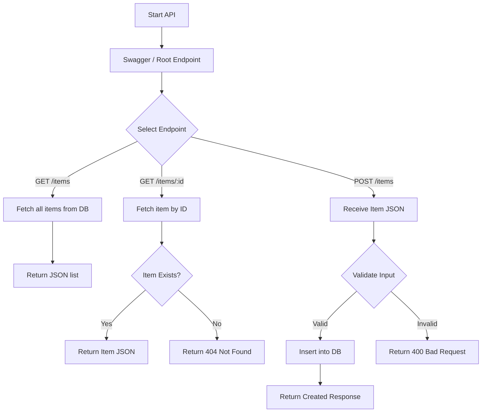

# Inventory Management System  

---
Project 1 – Programming Fundamentals (CA-PRFND)
title: "Inventory Management System"
description: "C# Programming Fundamentals Project by Marc Cavada"
author: "Marc Cavada"

## 📘 Introduction  

This project is a **prototype Inventory Management System** developed in **C# using .NET 9 and Visual Studio Code**.  
It captures and manages inventory items using **EF Core and SQLite**, exposing a **RESTful API** with Swagger/OpenAPI support.

---

## 📂 InventoryAPI – Code Files

### 1. Program.cs

```csharp
using Microsoft.EntityFrameworkCore;
using InventoryAPI;

var builder = WebApplication.CreateBuilder(args);

builder.Services.AddDbContext<InventoryDbContext>(options =>
    options.UseSqlite("Data Source=inventory.db"));

builder.Services.AddEndpointsApiExplorer();
builder.Services.AddSwaggerGen();

var app = builder.Build();

if (app.Environment.IsDevelopment())
{
    app.UseSwagger();
    app.UseSwaggerUI();
}

app.UseHttpsRedirection();

app.MapGet("/", () => "Inventory API is running.");
app.MapGet("/items", async (InventoryDbContext db) => await db.Items.ToListAsync());
app.MapGet("/items/{id}", async (int id, InventoryDbContext db) =>
{
    var item = await db.Items.FindAsync(id);
    return item != null ? Results.Ok(item) : Results.NotFound();
});
app.MapPost("/items", async (Item newItem, InventoryDbContext db) =>
{
    db.Items.Add(newItem);
    await db.SaveChangesAsync();
    return Results.Created($"/items/{newItem.Id}", newItem);
});

app.Run();
```

### 2. InventoryDbContext.cs

```csharp
using Microsoft.EntityFrameworkCore;

namespace InventoryAPI
{
    public class InventoryDbContext: DbContext
    {
        public InventoryDbContext(DbContextOptions<InventoryDbContext> options) : base(options) { }
        public DbSet<Item> Items { get; set; }
    }
}
```

### 3. Item.cs

```csharp
namespace InventoryAPI
{
    public record Item(int Id, string FirstName, string LastName, double Price);
}
```

### 4. InventoryAPI.csproj

```csharp
<Project Sdk="Microsoft.NET.Sdk.Web">
  <PropertyGroup>
    <TargetFramework>net9.0</TargetFramework>
    <Nullable>enable</Nullable>
    <ImplicitUsings>enable</ImplicitUsings>
  </PropertyGroup>
  <ItemGroup>
    <PackageReference Include="Microsoft.EntityFrameworkCore.Sqlite" Version="8.0.7" />
    <PackageReference Include="Microsoft.EntityFrameworkCore.Tools" Version="8.0.7">
      <PrivateAssets>all</PrivateAssets>
      <IncludeAssets>runtime; build; native; contentfiles; analyzers; buildtransitive</IncludeAssets>
    </PackageReference>
    <PackageReference Include="Swashbuckle.AspNetCore" Version="6.7.0" />
  </ItemGroup>
</Project>
```

### 5. InventoryAPI.http

```csharp
GET https://localhost:7255/items
GET https://localhost:7255/items/1
POST https://localhost:7255/items
Content-Type: application/json

{
  "id": 101,
  "firstName": "Apple",
  "lastName": "Box",
  "price": 499.99
}
```

🧰 Setup Instructions

Prerequisites
 • .NET 9 SDK
 • Visual Studio Code or Visual Studio
 • SQLite CLI (optional)

Build & Run

cd InventoryAPI
dotnet restore
dotnet build
dotnet run

API will run on:
 • HTTPS: <https://localhost:7255>
 • HTTP: <http://localhost:5091>

Database Migrations

dotnet ef migrations add InitialCreate --project InventoryAPI
dotnet ef database update --project InventoryAPI

⸻

💾 Database Model

Item.cs

```csharp
public class Item
{
    public int Id { get; set; }
    public string FirstName { get; set; }
    public string LastName { get; set; }
    public double Price { get; set; }
}
```

InventoryDbContext.cs

```csharp
using Microsoft.EntityFrameworkCore;

public class InventoryDbContext: DbContext
{
    public InventoryDbContext(DbContextOptions<InventoryDbContext> options) : base(options) { }
    public DbSet<Item> Items { get; set; }
}
```

⚙️ API Endpoints

Endpoint Method Description
/ GET Health check / Root message
/items GET Fetch all items
/items/{id} GET Fetch a single item by ID
/items POST Add a new item

Swagger UI: <https://localhost:7255/swagger>

📊 Program Flow (Diagram)



🔧 Development Highlights
 • Minimal API with ASP.NET Core
 • EF Core SQLite integration
 • Input validation for IDs and prices
 • Async/await for database operations
 • Swagger/OpenAPI for endpoint testing

⸻

🧩 Folder Structure

InventoryAPI/
├── Program.cs
├── Item.cs
├── InventoryDbContext.cs
├── appsettings.json
├── appsettings.Development.json
├── Properties/
├── bin/
├── obj/
└── InventoryAPI.csproj

⸻

👨‍💻 Author

Marc Cavada
Programming Fundamentals – CDI College
Project: CA_PRFND – Inventory Management System

✅ This version is **GitHub-ready**:  
All C#, XML, and HTTP blocks are fenced separately.  
Mermaid diagram is standalone.  
Folder structure uses its own code block.  
Text and headings are outside code blocks, so everything renders correctly.  
