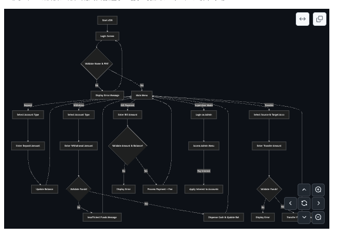
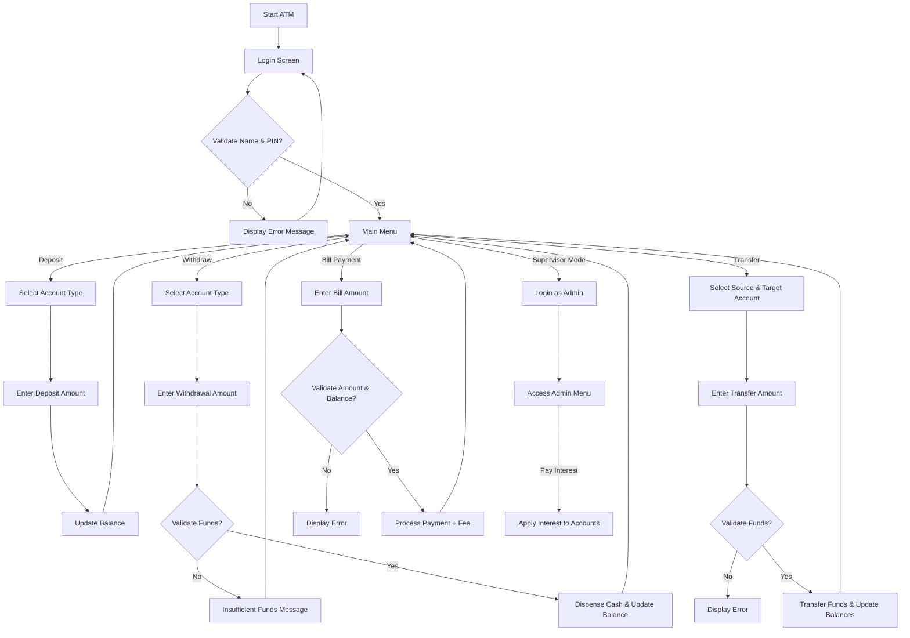
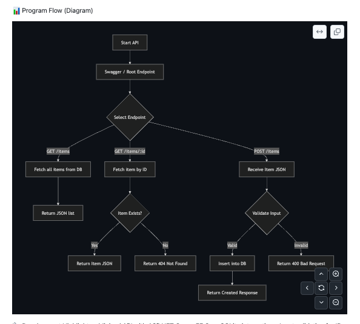
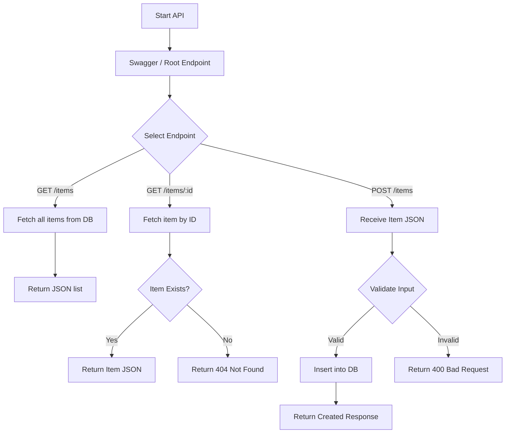

# Programming Projects

title: "ATM Teller Simulator"
description: "C# Programming Fundamentals Project by Marc Cavada"
author: "Marc Cavada"

This project is a prototype of:

- **Project 1: Inventory Management System**
- **Project 2: ATM Teller**
  
developed in **C# using .NET 9 and Visual Studio Code**. It captures and manages inventory items using **EF Core and SQLite**, exposing a **RESTful API** with Swagger/OpenAPI support.

---

## 🔗 Project Repository

The source code and full project files for:

- **Project 1 – Inventory Management System**
- **Project 2 – ATM Teller Simulator**

are available on GitHub:  
[https://github.com/mocavada/CAVADA-MARC-PROJECT-CA_PR](https://github.com/mocavada/CAVADA-MARC-PROJECT-CA_PR)

---

Perfect! Here’s your full README in Markdown syntax, ready for direct copy-and-paste into a .md file, with all code blocks properly fenced:

## Project 2 – ATM Teller Simulation

Programming Techniques (CA-PRTQS)

---

## 📂 TellerAPI – Code Files

### Program.cs

```csharp

using System;
using TellerAPI.Models;
using TellerAPI.Services;

namespace TellerAPI
{
    public class Program
    {
        public static void Main()
        {
            Bank bank = new Bank();
            var atm = new ATMService(bank);
            atm.Start();
        }
    }
}


⸻

Models/Account.cs

using System;

namespace TellerAPI.Models
{
    public abstract class Account
    {
        public string AccountNumber { get; set; } = string.Empty;
        public string CustomerID { get; set; } = string.Empty;
        public decimal Balance { get; protected set; }

        public virtual void Deposit(decimal amount)
        {
            if (amount <= 0)
                throw new ArgumentException("Deposit amount must be positive.");
            Balance += amount;
        }

        public virtual bool Withdraw(decimal amount)
        {
            if (amount <= 0)
                throw new ArgumentException("Withdrawal amount must be positive.");
            if (Balance < amount)
                return false;

            Balance -= amount;
            return true;
        }

        public override string ToString() =>
            $"{AccountNumber} | Customer: {CustomerID} | Balance: {Balance:C}";
    }
}


⸻

Models/CheckingAccount.cs & Models/SavingAccount.cs

namespace TellerAPI.Models
{
    public class CheckingAccount : Account { }
    public class SavingAccount : Account { }
}


⸻

Models/Bank.cs

using System;
using System.Collections.Generic;
using TellerAPI.Services;

namespace TellerAPI.Models
{
    public class Bank
    {
        private readonly FileService _fileService;
        public List<Account> Accounts { get; private set; } = new();

        public Bank()
        {
            _fileService = new FileService();
            LoadAccounts();
        }

        private void LoadAccounts()
        {
            var lines = _fileService.ReadFile("Accounts.txt");

            foreach (var line in lines)
            {
                var parts = line.Split(',');
                if (parts.Length < 4) continue;

                string type = parts[0].Trim();           
                string accountNumber = parts[1].Trim();  
                string customerId = parts[2].Trim();     
                if (!decimal.TryParse(parts[3], out decimal balance))
                    balance = 0;

                Account? account = type switch
                {
                    "Checking" => new CheckingAccount { CustomerID = customerId, AccountNumber = accountNumber },
                    "Saving" => new SavingAccount { CustomerID = customerId, AccountNumber = accountNumber },
                    _ => null
                };

                if (account != null && balance > 0)
                    account.Deposit(balance);

                if (account != null)
                    Accounts.Add(account);
            }
        }

        public Account? GetAccount(string accountNumber) =>
            Accounts.Find(a => a.AccountNumber == accountNumber);

        public List<Account> GetAccountsByCustomer(string customerId) =>
            Accounts.FindAll(a => a.CustomerID == customerId);
    }
}


⸻

Services/FileService.cs

using System;
using System.Collections.Generic;
using System.IO;

namespace TellerAPI.Services
{
    public class FileService
    {
        private readonly string _dataPath;

        public FileService()
        {
            _dataPath = Path.Combine(AppContext.BaseDirectory, "..", "..", "..", "Data");
        }

        public List<string> ReadFile(string fileName)
        {
            string path = Path.Combine(_dataPath, fileName);
            if (!File.Exists(path))
            {
                Console.WriteLine($"❌ File not found: {path}");
                return new List<string>();
            }
            return new List<string>(File.ReadAllLines(path));
        }

        public void WriteFile(string fileName, List<string> lines)
        {
            string path = Path.Combine(_dataPath, fileName);
            File.WriteAllLines(path, lines);
        }

        public void AppendLine(string fileName, string line)
        {
            string path = Path.Combine(_dataPath, fileName);
            File.AppendAllText(path, line + Environment.NewLine);
        }
    }
}


⸻

Services/ATMService.cs

using System;
using TellerAPI.Models;

namespace TellerAPI.Services
{
    public class ATMService
    {
        private readonly Bank _bank;
        private Account _currentAccount = null!;

        public ATMService(Bank bank) => _bank = bank;

        public void Start()
        {
            Console.WriteLine("🏦 Welcome to the Teller API");

            // Login
            while (true)
            {
                Console.Write("\nEnter your account number: ");
                string? accNumber = Console.ReadLine();
                var account = _bank.GetAccount(accNumber ?? string.Empty);

                if (account != null)
                {
                    _currentAccount = account;
                    break;
                }
                Console.WriteLine("❌ Account not found. Try again.");
            }

            Console.WriteLine($"\n✅ Logged in as {_currentAccount.CustomerID}!");

            // Transaction loop
            while (true)
            {
                Console.WriteLine("\n1. Deposit\n2. Withdraw\n3. Check Balance\n4. Exit");
                Console.Write("\nSelect an option: ");
                string? input = Console.ReadLine();

                switch (input)
                {
                    case "1": HandleDeposit(); break;
                    case "2": HandleWithdrawal(); break;
                    case "3": Console.WriteLine($"💰 Current Balance: {_currentAccount.Balance:C}"); break;
                    case "4": Console.WriteLine("👋 Thank you for using TellerAPI!"); return;
                    default: Console.WriteLine("❌ Invalid option. Try again."); break;
                }
            }
        }

        private void HandleDeposit()
        {
            Console.Write("Enter deposit amount: ");
            if (decimal.TryParse(Console.ReadLine(), out decimal amount))
            {
                try
                {
                    _currentAccount.Deposit(amount);
                    Console.WriteLine($"✅ New Balance: {_currentAccount.Balance:C}");
                }
                catch (ArgumentException ex) { Console.WriteLine($"❌ {ex.Message}"); }
            }
            else Console.WriteLine("❌ Invalid amount entered.");
        }

        private void HandleWithdrawal()
        {
            Console.Write("Enter withdrawal amount: ");
            if (decimal.TryParse(Console.ReadLine(), out decimal amount))
            {
                try
                {
                    if (_currentAccount.Withdraw(amount))
                        Console.WriteLine($"✅ New Balance: {_currentAccount.Balance:C}");
                    else
                        Console.WriteLine("❌ Insufficient funds!");
                }
                catch (ArgumentException ex) { Console.WriteLine($"❌ {ex.Message}"); }
            }
            else Console.WriteLine("❌ Invalid amount entered.");
        }
    }
}

```

⸻

📂 Data Files

TellerAPI/Data/
 Accounts.txt – Each line: <AccountType>,<AccountNumber>,<CustomerID>,<Balance>

Example: Checking,10001,D001,457.98
 • Customers.txt – Optional customer info
 • DailyBalances.txt – Optional daily transactions

⸻

Usage

dotnet run --project TellerAPI/TellerAPI.csproj

 • Enter account number to login.
 • Follow menu to deposit, withdraw, or check balance.

⸻

Folder Structure

TellerAPI/
├─ Data/
├─ Models/
├─ Services/
├─ Program.cs
└─ TellerAPI.csproj

⸻

✅ Key Features
 • Loads accounts from Accounts.txt
 • Supports deposit, withdrawal, and balance check
 • Protects Balance with protected set
 • File operations via FileService
 • ATMService handles account operations

⸻

### Program Flow (Teller API Diagram)





---

## 📂 InventoryAPI – Code Files

### 1. Program.cs

```csharp
using Microsoft.EntityFrameworkCore;
using InventoryAPI;

var builder = WebApplication.CreateBuilder(args);

builder.Services.AddDbContext<InventoryDbContext>(options =>
    options.UseSqlite("Data Source=inventory.db"));

builder.Services.AddEndpointsApiExplorer();
builder.Services.AddSwaggerGen();

var app = builder.Build();

if (app.Environment.IsDevelopment())
{
    app.UseSwagger();
    app.UseSwaggerUI();
}

app.UseHttpsRedirection();

app.MapGet("/", () => "Inventory API is running.");
app.MapGet("/items", async (InventoryDbContext db) => await db.Items.ToListAsync());
app.MapGet("/items/{id}", async (int id, InventoryDbContext db) =>
{
    var item = await db.Items.FindAsync(id);
    return item != null ? Results.Ok(item) : Results.NotFound();
});
app.MapPost("/items", async (Item newItem, InventoryDbContext db) =>
{
    db.Items.Add(newItem);
    await db.SaveChangesAsync();
    return Results.Created($"/items/{newItem.Id}", newItem);
});

app.Run();
```

### 2. InventoryDbContext.cs

```csharp
using Microsoft.EntityFrameworkCore;

namespace InventoryAPI
{
    public class InventoryDbContext: DbContext
    {
        public InventoryDbContext(DbContextOptions<InventoryDbContext> options) : base(options) { }
        public DbSet<Item> Items { get; set; }
    }
}
```

### 3. Item.cs

```csharp
namespace InventoryAPI
{
    public record Item(int Id, string FirstName, string LastName, double Price);
}
```

### 4. InventoryAPI.csproj

```csharp
<Project Sdk="Microsoft.NET.Sdk.Web">
  <PropertyGroup>
    <TargetFramework>net9.0</TargetFramework>
    <Nullable>enable</Nullable>
    <ImplicitUsings>enable</ImplicitUsings>
  </PropertyGroup>
  <ItemGroup>
    <PackageReference Include="Microsoft.EntityFrameworkCore.Sqlite" Version="8.0.7" />
    <PackageReference Include="Microsoft.EntityFrameworkCore.Tools" Version="8.0.7">
      <PrivateAssets>all</PrivateAssets>
      <IncludeAssets>runtime; build; native; contentfiles; analyzers; buildtransitive</IncludeAssets>
    </PackageReference>
    <PackageReference Include="Swashbuckle.AspNetCore" Version="6.7.0" />
  </ItemGroup>
</Project>
```

### 5. InventoryAPI.http

```csharp
GET https://localhost:7255/items
GET https://localhost:7255/items/1
POST https://localhost:7255/items
Content-Type: application/json

{
  "id": 101,
  "firstName": "Apple",
  "lastName": "Box",
  "price": 499.99
}
```

🧰 Setup Instructions

Prerequisites
 • .NET 9 SDK
 • Visual Studio Code or Visual Studio
 • SQLite CLI (optional)

Build & Run

cd InventoryAPI
dotnet restore
dotnet build
dotnet run

API will run on:
 • HTTPS: <https://localhost:7255>
 • HTTP: <http://localhost:5091>

Database Migrations

dotnet ef migrations add InitialCreate --project InventoryAPI
dotnet ef database update --project InventoryAPI

⸻

💾 Database Model

Item.cs

```csharp
public class Item
{
    public int Id { get; set; }
    public string FirstName { get; set; }
    public string LastName { get; set; }
    public double Price { get; set; }
}
```

InventoryDbContext.cs

```csharp
using Microsoft.EntityFrameworkCore;

public class InventoryDbContext: DbContext
{
    public InventoryDbContext(DbContextOptions<InventoryDbContext> options) : base(options) { }
    public DbSet<Item> Items { get; set; }
}
```

⚙️ API Endpoints

Endpoint Method Description
/ GET Health check / Root message
/items GET Fetch all items
/items/{id} GET Fetch a single item by ID
/items POST Add a new item

Swagger UI: <https://localhost:7255/swagger>

📊 Program Flow (Diagram)

---

### Inventory API





⸻

🔧 Development Highlights
 • Minimal API with ASP.NET Core
 • EF Core SQLite integration
 • Input validation for IDs and prices
 • Async/await for database operations
 • Swagger/OpenAPI for endpoint testing

⸻

🧩 Folder Structure

InventoryAPI/
├── Program.cs
├── Item.cs
├── InventoryDbContext.cs
├── appsettings.json
├── appsettings.Development.json
├── Properties/
├── bin/
├── obj/
└── InventoryAPI.csproj

⸻

👨‍💻 Author

Marc Cavada
Programming Fundamentals – CDI College
Project: CA_PRFND – Inventory Management System

✅ This version is **GitHub-ready**:  
All C#, XML, and HTTP blocks are fenced separately.  
Mermaid diagram is standalone.  
Folder structure uses its own code block.  
Text and headings are outside code blocks, so everything renders correctly.  
