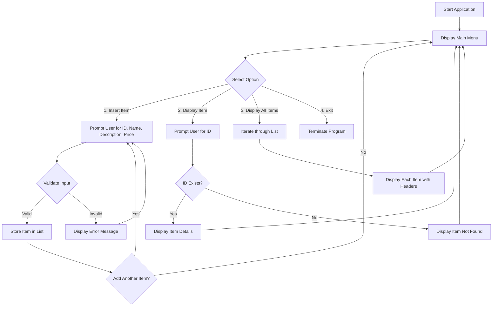

# 🧩 Inventory Management System  
**Project 1 – Programming Fundamentals (CA-PRFND)**  

## 📘 Introduction  
This project is a **prototype Inventory Management System** developed in **C# using Visual Studio .NET**.  
It simulates capturing and managing basic inventory information, allowing users to input, validate, and display product records while handling errors gracefully.  

---

## 📊 Program Flow (Mermaid Diagram)

🎯 Objectives

The main objectives of this project are to:
	•	Interpret specifications and perform requirement analysis.
	•	Design a functional solution based on requirements.
	•	Apply program logic, structures, and error-handling.
	•	Translate design into working source code in C#.
	•	Debug, test, and validate input/output.
	•	Use Visual Studio IDE features effectively.
	•	Demonstrate knowledge of procedural flow and control structures.

⸻

⏱️ Time Required

Approximately 30 hours are needed to complete this project, including:
	•	5 in-class sessions
	•	Homework, coding, testing, and validation

⸻

🧰 Required Materials
	•	Microsoft Visual Studio .NET (C#)
	•	Course textbook or documentation
	•	Project specifications and test cases provided by your instructor

⸻

🧠 Development Phases

Session 11: Analysis and Design
	•	Review project specifications and feature requirements.
	•	Create flowcharts and/or pseudocode for the overall program.
	•	Validate logic with your instructor before starting coding.

Session 12: Detailing Logic and Setup
	•	Refine process details per instructor feedback.
	•	Set up project structure in Visual Studio.
	•	Begin coding according to design documentation.

Sessions 13 to 15: Apply Analysis and Design to Coding
	•	Apply problem-solving skills.
	•	Implement program processes according to specifications.
	•	Add input validation and error handling for all data entry.
	•	Use iterative development: revise logic as needed and update documentation.
	•	Record any changes made to design or logic with justification.
	•	Validate the solution using provided test cases.
	•	Submit the final project.

⸻

🧪 Test Data

ID	Firstname	Lastname	Purchase	Comment
101	Pulses	Pulses pack	381.65	✅ Works without issues
200	Lemon	Lemon Box	587.17	❌ Reject (ID must be 3 characters)
234	Mango	Mango Box	587.17	✅ Works correctly
984	Apple	Apple Box	Two hundred	❌ Reject (Price must be numeric)
Abc	Test	Test description	45	❌ Reject (ID must be numeric)
1Ac	Test	Test description	20	❌ Reject (ID must be numeric)

💡 Additional test data should be created to test edge cases and exceptions.

⸻

🧱 Folder Structure

CAVADA-MARC-PROJECT-CAPRFND/
│
├── Program.cs                     # Main entry point
├── appsettings.json               # App configuration
├── appsettings.Development.json   # Development config
├── Properties/                    # Project metadata
├── bin/                           # Compiled binaries
├── obj/                           # Build files
├── Assignments/                   # Design & documentation
└── CAVADA-MARC-PROJECT-CAPRFND.csproj # Project file

⸻

⚙️ How to Run the Application

🖥️ Option 1 – Visual Studio
	1.	Open Visual Studio.
	2.	Go to File → Open → Project/Solution.
	3.	Open CAVADA-MARC-PROJECT-CAPRFND.csproj.
	4.	Build the project: Ctrl + Shift + B or Build → Build Solution.
	5.	Run the program: F5 or Debug → Start Debugging.
	6.	Follow prompts to test input, validation, and error handling.

💻 Option 2 – Command Line (Mac or Windows)

cd path/to/CAVADA-MARC-PROJECT-CAPRFND
dotnet run

	•	Enter sample data as prompted.
	•	Observe input validation, exception handling, and correct output.

⸻

🏆 Optional Enhancements (Bonus Features)
	•	Auto-increment IDs for new items.
	•	Display a list of all item IDs when selecting an item.
	•	Show item with the highest purchase price.
	•	Add sorting before displaying all inventory items.

⸻

🧩 Key Concepts Demonstrated
	•	Input validation & exception handling
	•	Conditional statements & loops
	•	Arrays or lists for data storage
	•	Procedural design & modularization
	•	Iterative development
	•	Testing & debugging in Visual Studio

⸻

✅ Submission Checklist
	•	✅ Functional C# application
	•	✅ Updated design & logic documentation
	•	✅ Complete test data & validation logs
	•	✅ README.mdx included in the repository

⸻

👨‍💻 Author

Marc Cavada
Programming Fundamentals – CDI College
Project: CA_PRFND – Inventory Management System

---

